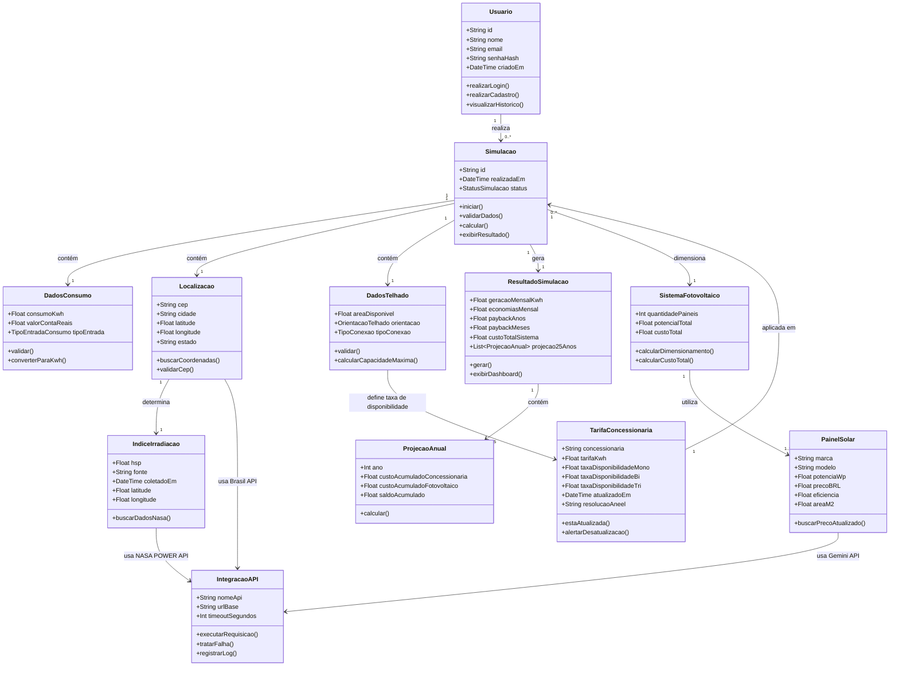
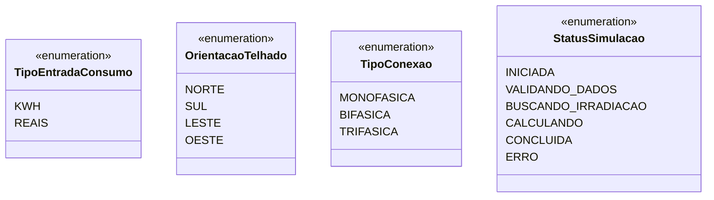
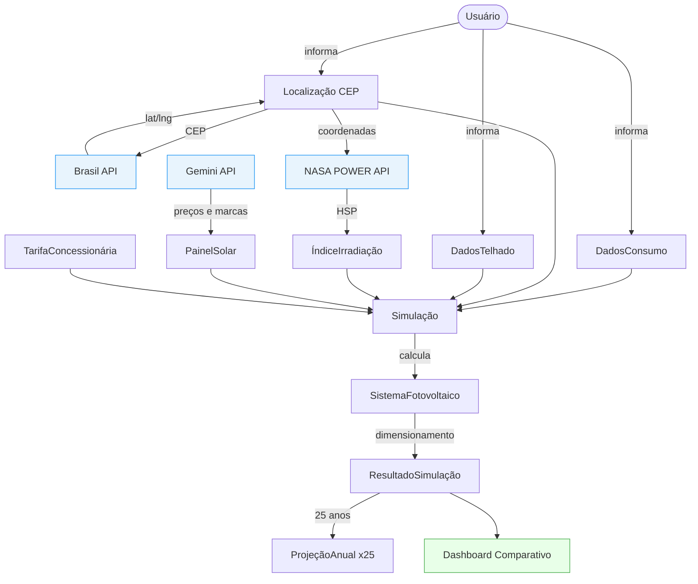

# Modelo de Domínio — SolarCalc

**Versão:** 1.0  
**Data:** 24/04/2026  
**Equipe:** Arthur De Almeida Santos, Gabriel Andre Iunis De Paula, Gabriel Lopes Montalvao

---

## 1. Diagrama de Domínio

---

## 2. Enumerações

---

## 3. Fluxo de Dados entre Entidades

---

## 4. Descrição das Entidades

### 4.1 Usuário
Representa a pessoa que acessa o sistema. Possui credenciais de autenticação e pode ter múltiplas simulações associadas à sua conta. Relaciona-se com os ADRs de autenticação ([ADR Nº 04](ADRs.md#adr-04)).

### 4.2 Simulação
Entidade central do domínio. Orquestra todo o fluxo de coleta de dados, integração com APIs e geração de resultados. Segue o fluxo definido nos [Requisitos Funcionais (RF01 a RF07)](RF.md) e respeita as [Regras de Negócio (RB01 a RB10)](RB.md).

### 4.3 DadosConsumo
Encapsula os dados de consumo de energia informados pelo usuário, seja em kWh ou em valor monetário (R$). Aplica a [RB01](RB.md#rb01) para validação.

### 4.4 Localização
Responsável por armazenar e resolver a localização geográfica do imóvel. Converte CEP em coordenadas via Brasil API, conforme [RB02](RB.md#rb02) e [ADR Nº 05](ADRs.md#adr-05).

### 4.5 DadosTelhado
Registra as características físicas do local de instalação: área disponível e orientação. Determina também o tipo de conexão elétrica para aplicação da taxa de disponibilidade ([RB04](RB.md#rb04), [RB05](RB.md#rb05)).

### 4.6 ÍndiceIrradiação
Armazena os dados de HSP (Horas de Pico de Sol) obtidos da NASA POWER API para as coordenadas do imóvel. É obrigatório para o cálculo, conforme [RB03](RB.md#rb03).

### 4.7 PainelSolar
Representa um modelo de painel fotovoltaico com seus atributos técnicos e financeiros. Os preços são obtidos dinamicamente via Gemini API para evitar defasagem.

### 4.8 SistemaFotovoltaico
Representa o sistema fotovoltaico dimensionado para o imóvel, composto por um conjunto de painéis. Limita a quantidade de painéis pela área disponível ([RB04](RB.md#rb04)).

### 4.9 ResultadoSimulação
Agrega todos os resultados calculados: geração mensal, economia, payback e a projeção de 25 anos. Só é exibido após todos os cálculos concluídos com sucesso ([RB10](RB.md#rb10)).

### 4.10 ProjeçãoAnual
Representa o resultado financeiro de cada ano da projeção de 25 anos. Permite gerar o gráfico de payback do dashboard comparativo ([RF07](RF.md#rf07)).

### 4.11 TarifaConcessionária
Mantém as tarifas de energia vigentes por concessionária, conforme normas ANEEL. Deve ser atualizada mensalmente ([RB07](RB.md#rb07), [RNF04](RNFs.md#rnf04)).

### 4.12 IntegraçãoAPI
Abstração das chamadas para APIs externas, com controle de timeout de 10 segundos e tratamento de falhas, conforme [ADR Nº 03](ADRs.md#adr-03) e [RNF05](RNFs.md#rnf05).

---

## 5. Regras de Domínio Mapeadas

| Regra | Entidade Afetada | Referência |
|-------|-----------------|------------|
| Consumo deve ser maior que zero | DadosConsumo | [RB01](RB.md#rb01) |
| CEP deve ser válido antes de simular | Localização | [RB02](RB.md#rb02) |
| Irradiação obrigatória para calcular | ÍndiceIrradiação | [RB03](RB.md#rb03) |
| Painéis limitados pela área disponível | SistemaFotovoltaico | [RB04](RB.md#rb04) |
| Taxa de disponibilidade por tipo de conexão | DadosTelhado / TarifaConcessionária | [RB05](RB.md#rb05) |
| Payback baseado em comparação de custos acumulados | ResultadoSimulação | [RB06](RB.md#rb06) |
| Alertar se tarifas estiverem desatualizadas | TarifaConcessionária | [RB07](RB.md#rb07) |
| Validar todos os dados antes de calcular | Simulação | [RB08](RB.md#rb08) |
| Timeout de 30 segundos para a simulação | Simulação / IntegraçãoAPI | [RB09](RB.md#rb09) |
| Exibir resultado apenas após cálculo completo | ResultadoSimulação | [RB10](RB.md#rb10) |
