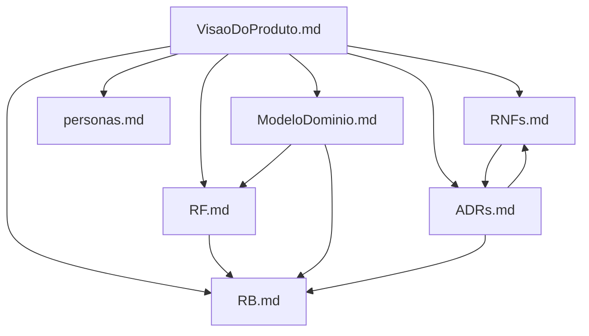

# Índice de Referências Cruzadas — SolarCalc

**Versão:** 1.0  
**Data:** 24/04/2026  
**Finalidade:** Mapear as dependências e conexões entre todos os documentos do projeto SolarCalc

---

## 1. Mapa Geral de Documentos

---

## 2. Requisitos Funcionais × Regras de Negócio

| Requisito Funcional | Regra de Negócio Relacionada | Descrição da Relação |
|--------------------|------------------------------|----------------------|
| [RF01 — Coleta de Consumo](RF.md#rf01) | [RB01](RB.md#rb01) | RB01 define que consumo deve ser > 0 para permitir simulação |
| [RF01.1 — Equivalência em kWh (entrada em reais)](RF.md#rf-01-1) | [RB01](RB.md#rb01) | RB01 obriga conversão R$→kWh pela mesma tarifa usada na projeção; bloqueio se tarifa aplicável inexistir |
| [RF02 — Localização Geográfica](RF.md#rf02) | [RB02](RB.md#rb02) | RB02 exige CEP válido antes de prosseguir |
| [RF02 — Localização Geográfica](RF.md#rf02) | [RB03](RB.md#rb03) | RB03 exige dados de irradiação disponíveis para calcular |
| [RF03 — Especificação de Área](RF.md#rf03) | [RB04](RB.md#rb04) | RB04 limita painéis pela área informada |
| [RF04 — Perfil de Conexão](RF.md#rf04) | [RB05](RB.md#rb05) | RB05 aplica taxa de disponibilidade por tipo de conexão |
| [RF05 — Geração Estimada](RF.md#rf05) | [RB03](RB.md#rb03), [RB08](RB.md#rb08) | Cálculo depende de irradiação válida e dados validados |
| [RF06 — Estimativa de Payback](RF.md#rf06) | [RB06](RB.md#rb06), [RB07](RB.md#rb07) | Payback depende de tarifas atualizadas e cálculo correto |
| [RF07 — Dashboard Comparativo](RF.md#rf07) | [RB09](RB.md#rb09), [RB10](RB.md#rb10) | Exibido apenas após cálculo completo, dentro do limite de 30s |

---

## 3. Requisitos Funcionais × Requisitos Não Funcionais

| Requisito Funcional | Requisito Não Funcional | Descrição da Relação |
|--------------------|------------------------|----------------------|
| [RF02](RF.md#rf02) (Brasil API) | [RNF01](RNFs.md#rnf01) (Desempenho) | Chamada à API inclusa no limite de 30s |
| [RF02](RF.md#rf02) (Brasil API) | [RNF05](RNFs.md#rnf05) (Tolerância a Falhas) | Falha da Brasil API deve ser tratada com timeout de 10s |
| [RF05](RF.md#rf05) (NASA API) | [RNF01](RNFs.md#rnf01) (Desempenho) | Chamada à NASA inclusa no limite de 30s |
| [RF05](RF.md#rf05) (NASA API) | [RNF05](RNFs.md#rnf05) (Tolerância a Falhas) | Falha da NASA API deve ser tratada com timeout de 10s |
| [RF07](RF.md#rf07) (Dashboard) | [RNF02](RNFs.md#rnf02) (Usabilidade) | Gráficos acessíveis para daltônicos |
| [RF07](RF.md#rf07) (Dashboard) | [RNF03](RNFs.md#rnf03) (Portabilidade) | Dashboard responsivo para todos os dispositivos |
| Todos os RFs | [RNF02](RNFs.md#rnf02) (Usabilidade) | Fluxo máximo de 5 etapas |
| Todos os RFs (valores) | [RNF04](RNFs.md#rnf04) (Confiabilidade) | Todos os valores em BRL e sistema métrico |

---

## 4. ADRs × Requisitos e Regras

| ADR | Requisito / Regra Relacionado | Descrição da Relação |
|-----|------------------------------|----------------------|
| [ADR Nº 01 — Plataforma Web](ADRs.md#adr-01) | [RNF03](RNFs.md#rnf03) | A escolha web suporta o requisito de responsividade |
| [ADR Nº 02 — Arquitetura Monolítica](ADRs.md#adr-02) | [RNF01](RNFs.md#rnf01) | Monólito deve atender ao desempenho de 30s |
| [ADR Nº 03 — Tratamento de Falhas](ADRs.md#adr-03) | [RNF05](RNFs.md#rnf05), [RB09](RB.md#rb09) | Define timeout de 10s por API e 30s total |
| [ADR Nº 04 — Autenticação](ADRs.md#adr-04) | [RF01](RF.md#rf01) a [RF07](RF.md#rf07) | Autenticação é pré-condição para usar as funcionalidades |
| [ADR Nº 05 — Seleção de APIs](ADRs_adicionais.md#adr-05) | [RF02](RF.md#rf02), [RF05](RF.md#rf05), [RB02](RB.md#rb02), [RB03](RB.md#rb03) | Define quais APIs implementam os requisitos de localização e irradiação |
| [ADR Nº 06 — Banco de Dados](ADRs_adicionais.md#adr-06) | [ADR Nº 04](ADRs.md#adr-04), [RB07](RB.md#rb07), [RNF04](RNFs.md#rnf04) | PostgreSQL suporta autenticação, histórico e atualização de tarifas |

---

## 5. Personas × Requisitos Funcionais

| Persona | Necessidade Principal | Requisito Funcional que Atende |
|---------|-----------------------|-------------------------------|
| [Carlos Almeida](personas.md#persona-1) — Proprietário residencial | Entender payback rapidamente | [RF06](RF.md#rf06) — Estimativa de Payback |
| [Carlos Almeida](personas.md#persona-1) | Inserir consumo de forma simples | [RF01](RF.md#rf01) — Coleta de Consumo |
| [Carlos Almeida](personas.md#persona-1) | Não entende impacto da localização | [RF02](RF.md#rf02) — Localização + dados NASA |
| [Carlos Almeida](personas.md#persona-1) | Ver resultado visual claro | [RF07](RF.md#rf07) — Dashboard Comparativo |
| [Mariana Torres](personas.md#persona-2) — Pequena comerciante | Comparar cenários com/sem solar | [RF07](RF.md#rf07) — Dashboard Comparativo |
| [Mariana Torres](personas.md#persona-2) | Base numérica para apresentar aos sócios | [RF06](RF.md#rf06) + [RF07](RF.md#rf07) |
| [Mariana Torres](personas.md#persona-2) | Precisão no cálculo de economia | [RF05](RF.md#rf05) + [RF04](RF.md#rf04) (taxa de conexão) |

---

## 6. Modelo de Domínio × Regras de Negócio

| Entidade do Domínio | Regra de Negócio | Descrição |
|---------------------|-----------------|-----------|
| `DadosConsumo` | [RB01](RB.md#rb01) | Validar consumo > 0 antes de prosseguir |
| `Localizacao` | [RB02](RB.md#rb02) | CEP inválido bloqueia a simulação |
| `IndiceIrradiacao` | [RB03](RB.md#rb03) | Sem dados NASA, cálculo não prossegue |
| `SistemaFotovoltaico` | [RB04](RB.md#rb04) | Quantidade de painéis ≤ área disponível / área por painel |
| `DadosTelhado` → `TarifaConcessionaria` | [RB05](RB.md#rb05) | Tipo de conexão determina taxa de disponibilidade |
| `ResultadoSimulacao` | [RB06](RB.md#rb06) | Payback = comparação custo acumulado concessionária vs fotovoltaico |
| `TarifaConcessionaria` | [RB07](RB.md#rb07) | Alertar se `atualizado_em` > 35 dias |
| `Simulacao` | [RB08](RB.md#rb08) | Validar todos os dados antes de iniciar os cálculos |
| `Simulacao` + `IntegracaoAPI` | [RB09](RB.md#rb09) | Interromper e notificar usuário se total > 30s |
| `ResultadoSimulacao` | [RB10](RB.md#rb10) | Exibir resultado somente após cálculo 100% concluído |

---

## 7. Rastreabilidade: Visão do Produto → Demais Documentos

| Seção da Visão do Produto | Documento de Referência |
|--------------------------|------------------------|
| Seção 4 — Objetivos | [RF.md](RF.md), [RNFs.md](RNFs.md) |
| Seção 5 — Público-Alvo | [personas.md](personas.md) |
| Seção 8 — Funcionalidades Principais | [RF.md](RF.md) — RF01 a RF07 |
| Seção 10 — Restrições e Premissas | [RNFs.md](RNFs.md) — RNF01 a RNF05 |
| Seção 11 — Diferenciais | [ADRs_adicionais.md](ADRs_adicionais.md) — ADR Nº 05 |
| Seção 13 — Arquitetura e Integrações | [ADRs.md](ADRs.md) — ADR Nº 02, [ADRs_adicionais.md](ADRs_adicionais.md) — ADR Nº 05 e 06 |
| Seção 14 — Requisitos Não Funcionais | [RNFs.md](RNFs.md) |

---

## 8. Checklist de Completude Documental

| Documento | Status | Observações |
|-----------|--------|-------------|
| VisaoDoProduto_completo.md | ✅ Completo | Expandido com seções de arquitetura, riscos, glossário, revisão e referências |
| RF.md | ✅ Completo | RF01 a RF07 definidos |
| RNFs.md | ✅ Completo | RNF01 a RNF05 definidos |
| RB.md | ✅ Completo | RB01 a RB10 definidos |
| personas.md | ✅ Completo | Carlos Almeida e Mariana Torres |
| ADRs.md | ✅ Completo | ADR Nº 01 a 04 (originais) |
| ADRs_adicionais.md | ✅ Novo | ADR Nº 05 (APIs externas) e ADR Nº 06 (Banco de Dados) |
| ModeloDominio.md | ✅ Novo | Diagrama de classes Mermaid + fluxo de dados + descrição das entidades |
| ReferenciasDocumentais.md | ✅ Novo | Este documento — índice de rastreabilidade entre todos os artefatos |
